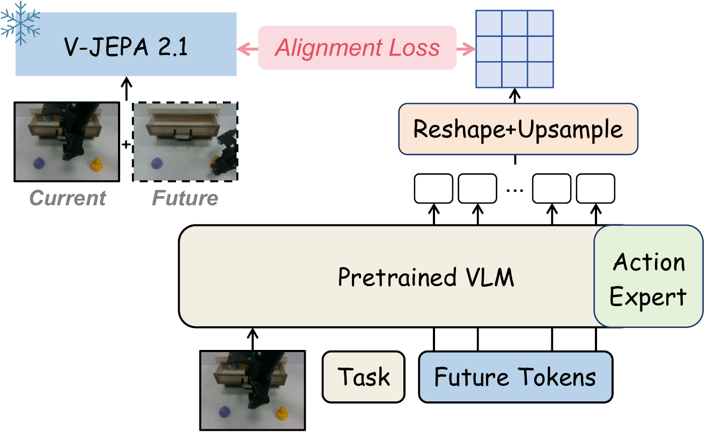

# JEPA-WAM for OpenPI

This repository contains the OpenPI implementation of the JEPA-WAM transition objective for a pretrained
π0.5 policy. It follows the pretrained-VLA transfer design described in *JEPA-WAM: Learning
Vision-Language-Action Policies with Joint-Embedding World Modeling*: a frozen V-JEPA 2.1 teacher constructs a
spatially structured joint current–future target, while learned future tokens in π0.5 predict that target during
policy training.

The transition objective is training-only. It supervises the shared VLM backbone without replacing π0.5's original
visual input or action expert, and it does not require V-JEPA at deployment.

The upstream OpenPI documentation remains unchanged in [README.md](README.md). This document covers only the
JEPA-WAM additions.

## Architecture

<p align="center">
  
</p>

For a dataset observation at time `t`, the frozen teacher jointly encodes the current frame and a future frame from
the same episode:

```text
current = observation[t]
future  = observation[min(t + delta, final_frame)]
target  = stop_gradient(V-JEPA-2.1(stack_time(current, future)))
```

Joint encoding makes both temporal endpoints available to the teacher. Unlike a globally pooled target, the target
retains V-JEPA's dense patch ordering and therefore supplies patch-wise transition supervision.

Inside π0.5, 64 learned future tokens are appended to the vision-language prefix:

```text
[image tokens][language tokens][64 future tokens][action tokens]
```

Their final hidden states are arranged as an `8 x 8` feature map, projected into the 1408-dimensional V-JEPA space,
and resized to the teacher's `24 x 24` patch grid:

```text
[B, 64, 2048]
    -> LayerNorm + MLP
    -> [B, 8, 8, 1408]
    -> bilinear upsampling
    -> [B, 576, 1408]
```

The auxiliary objective is the mean patch-wise cosine distance:

```text
L_jepa = mean(1 - cosine(predicted_target, stop_gradient(target)))
weight(step) = lambda_jepa * min(step / warmup_steps, 1)
L_total = L_flow + weight(step) * L_jepa
```

The supplied configuration uses `lambda_jepa=0.1` and `warmup_steps=1000`.

By default, future tokens can read the image-language prefix and one another, while action tokens do not attend to
future tokens. This keeps π0.5's original action-conditioning route intact while the JEPA loss still updates the
shared VLM backbone. Set `vjepa_action_attends_queries=True` only if you intentionally want action tokens to consume
the predicted-transition representations.

## What is included

- An opt-in V-JEPA auxiliary branch for the JAX π0.5 model.
- Resumable, multi-GPU target precomputation from a local LeRobot dataset.
- Per-episode `float16` targets, a validated manifest, memory mapping, and a bounded per-worker LRU cache.
- A ready-to-run LIBERO configuration named `pi05_libero_vjepa_aux`.
- Launchers for target planning, smoke testing, preprocessing, training, and checkpoint resume.
- Focused model, data-loader, and checkpoint-loading tests.

The integration is disabled by default. Upstream π0, π0.5, and π0-FAST configurations retain their original
parameter structure, attention mask, data loading, and loss.

## 1. Installation

Clone this repository and initialize OpenPI's submodules:

```bash
git clone https://github.com/SpriteWithoutIce/openpi_jepawam.git
cd openpi_jepawam
git submodule update --init --recursive
```

Create the normal OpenPI environment:

```bash
GIT_LFS_SKIP_SMUDGE=1 uv sync
GIT_LFS_SKIP_SMUDGE=1 uv pip install -e .
```

The target precomputation code uses PyTorch, Pillow, OpenCV, NumPy, PyArrow, and `timm`. These dependencies are
recorded in `pyproject.toml` and `uv.lock`.

## 2. Prepare a LeRobot dataset

The precomputation script expects a local LeRobot dataset with metadata and per-episode Parquet files:

```text
DATASET_ROOT/
  meta/info.json
  meta/episodes.jsonl
  data/chunk-000/episode_000000.parquet
  videos/...                         # if the selected image feature is video-backed
```

Each row must provide `episode_index`, `frame_index`, and the selected image feature. Embedded images and
video-backed image features are both supported. The public LIBERO example uses the feature key `image`.

For a custom dataset, check that `meta/info.json` reports the correct episode count, frame count, FPS, image feature,
and video layout before preprocessing.

## 3. Prepare the frozen V-JEPA teacher

Clone the official V-JEPA 2 implementation and use the tested source revision:

```bash
git clone https://github.com/facebookresearch/vjepa2.git ../vjepa2
git -C ../vjepa2 checkout 204698b45b3712590f06245fbfba32d3be539812
```

Download the official V-JEPA 2.1 ViT-g/384 pretraining checkpoint:

```bash
mkdir -p data/weights/vjepa2
wget https://dl.fbaipublicfiles.com/vjepa2/vjepa2_1_vitg_384.pt \
  -O data/weights/vjepa2/vjepa2_1_vitg_384.pt
```

The precomputation code loads the frozen `target_encoder`. For ViT-g/384, one two-frame input produces a `24 x 24`
grid with feature dimension 1408, or `[576, 1408]` after flattening.

## 4. Precompute joint current–future targets

Set the paths and temporal offset:

```bash
export DATASET_ROOT=/path/to/lerobot/physical-intelligence/libero
export VJEPA_SOURCE_ROOT=/path/to/vjepa2
export VJEPA_CHECKPOINT="$PWD/data/weights/vjepa2/vjepa2_1_vitg_384.pt"
export OUTPUT_ROOT="$PWD/data/vjepa_targets/libero_vjepa2_1_vitg_384_offset31"
export IMAGE_KEY=image
export FUTURE_OFFSET=31
```

The teacher receives a current/future pair with shape `[B, 3, 2, 384, 384]`. Near an episode boundary, the future
index is clamped to the final frame.

First inspect the number of episodes, number of frames, and expected storage:

```bash
bash scripts/run_precompute_vjepa_targets.sh plan
```

Run a one-episode end-to-end test before launching the full job:

```bash
GPU_IDS=0 BATCH_SIZE=1 bash scripts/run_precompute_vjepa_targets.sh smoke
```

Run one independent worker per selected GPU:

```bash
GPU_IDS=0,1,2,3,4,5,6,7 \
BATCH_SIZE=1 \
bash scripts/run_precompute_vjepa_targets.sh run
```

Inspect progress at any time:

```bash
bash scripts/run_precompute_vjepa_targets.sh status
```

The output layout is:

```text
OUTPUT_ROOT/
  manifest.json
  targets/chunk-000/episode_000000.npy
  targets/chunk-000/episode_000000.json
  logs/worker-0.gpu0.log
  ...
```

Each NPY has shape `[episode_length, 576, 1408]` and dtype `float16`, which is approximately 1.55 MiB per frame.
Completed episode files are validated and skipped on restart. New files are written under a temporary name and
atomically renamed only after a complete episode succeeds.

The current public configuration supervises one selected LeRobot image feature per sample. To supervise multiple
camera views, extend preprocessing and the target shape together, preserving a fixed camera order as described by
the JEPA-WAM formulation.

## 5. Compute normalization statistics

The LIBERO auxiliary configuration reuses baseline π0.5 normalization statistics because robot state and action
representations are unchanged:

```bash
uv run scripts/compute_norm_stats.py --config-name pi05_libero
```

This writes the statistics under `assets/pi05_libero`, which `pi05_libero_vjepa_aux` references. For another robot
dataset, compute normalization statistics with matching state/action transforms and update the auxiliary config's
`AssetsConfig`.

## 6. Train π0.5 with the JEPA objective

Validate paths and print the exact command without starting training:

```bash
TARGET_ROOT="$OUTPUT_ROOT" \
GPU_IDS=0,1,2,3,4,5,6,7 \
BATCH_SIZE=128 \
FSDP_DEVICES=2 \
bash scripts/run_pi05_libero_vjepa.sh check
```

Start training:

```bash
TARGET_ROOT="$OUTPUT_ROOT" \
GPU_IDS=0,1,2,3,4,5,6,7 \
BATCH_SIZE=128 \
FSDP_DEVICES=2 \
EXP_NAME=libero_vjepa_offset31 \
bash scripts/run_pi05_libero_vjepa.sh start
```

The launcher defaults to 30,000 total steps and disables Weights & Biases. The most useful overrides are:

| Variable | Default | Meaning |
| --- | --- | --- |
| `TARGET_ROOT` | repository target directory | Precomputed target root containing `manifest.json` |
| `GPU_IDS` | `0,1,2,3,4,5,6,7` | Visible training GPUs |
| `BATCH_SIZE` | `128` | Global batch size |
| `FSDP_DEVICES` | `2` | Devices per FSDP shard |
| `NUM_STEPS` | `30000` | Final global training step |
| `NUM_WORKERS` | `2` | Data-loader workers |
| `CHECKPOINT_BASE_DIR` | `./checkpoints` | Checkpoint root |
| `BASE_PARAMS` | official π0.5 base parameters | Initialization checkpoint |
| `WANDB_ENABLED` | `0` | Enable W&B when set to `1` |

The equivalent direct trainer invocation is:

```bash
CUDA_VISIBLE_DEVICES=0,1,2,3,4,5,6,7 \
XLA_PYTHON_CLIENT_MEM_FRACTION=0.90 \
uv run scripts/train.py pi05_libero_vjepa_aux \
  --exp-name libero_vjepa_offset31 \
  --data.vjepa-target-root "$OUTPUT_ROOT" \
  --batch-size 128 \
  --fsdp-devices 2 \
  --num-train-steps 30000 \
  --no-wandb-enabled
```

The base π0.5 checkpoint does not contain the new future-token and alignment-head parameters. Its weight loader
allows only parameters matching `.*vjepa_.*` to be newly initialized; every original π0.5 parameter must still match.

Training reports:

```text
loss                  total training loss
flow_loss             original OpenPI flow-matching loss
vjepa_loss            patch-wise cosine distance
vjepa_cosine          1 - vjepa_loss
vjepa_weight          current warmup-adjusted weight
weighted_vjepa_loss   vjepa_weight * vjepa_loss
```

Spatial crop and rotation are disabled in the supplied JEPA configuration because they would change patch geometry
without applying the same transform to precomputed targets. Photometric augmentation remains enabled.

## 7. Resume a run

Use the same experiment name and checkpoint base directory. `NUM_STEPS` is the new final global step, not a number of
additional steps:

```bash
TARGET_ROOT="$OUTPUT_ROOT" \
GPU_IDS=0,1,2,3,4,5,6,7 \
BATCH_SIZE=128 \
FSDP_DEVICES=2 \
EXP_NAME=libero_vjepa_offset31 \
NUM_STEPS=60000 \
bash scripts/run_pi05_libero_vjepa.sh resume
```

The trainer restores parameters, optimizer state, EMA parameters, and global step. It starts a new shuffled data
iterator after resume.

## 8. Inference

Inference uses the normal π0.5 `sample_actions` path. The target encoder, future observations, and precomputed target
files are not required at deployment. Continue using the auxiliary model configuration when loading the checkpoint
so that its parameter tree includes the learned future tokens and alignment head; `observation.vjepa_target` may be
`None` during action sampling.

## 9. Adapting to another dataset

Copy `pi05_libero_vjepa_aux` and update these fields together:

- LeRobot `repo_id`, robot transforms, action dimension, and action horizon.
- `IMAGE_KEY` during preprocessing and `data.vjepa_image_key` during training.
- `FUTURE_OFFSET` and `data.vjepa_future_offset`.
- Repack transforms so `vjepa_target` survives preprocessing.
- Normalization assets.
- Target grid and feature dimension when using a teacher other than V-JEPA 2.1 ViT-g/384.

At data-loader construction, the manifest is checked against the expected target shape, dtype, dataset frame count,
future offset, and image key. A mismatch stops training before the first optimization step.

## 10. LIBERO and LIBERO-Plus rollout evaluation

The repository includes the complete standard LIBERO and LIBERO-Plus rollout path, including the pinned simulator
setup, checkpoint server, deterministic and resumable episode journals, task sharding, shard merging, seven-category
and difficulty summaries, and both task-micro and category-macro success rates.

See [README_LIBERO_EVAL.md](README_LIBERO_EVAL.md) for installation and commands. The shortest LIBERO-Plus smoke test
after starting a checkpoint server is:

```bash
RUN_ID=pi05-jepa-step30000 \
TASK_SUITE=libero_spatial \
TASK_START=0 \
TASK_END=1 \
bash scripts/run_libero_evaluation.sh plus
```

## 11. Tests and current scope

Run the focused test suite with:

```bash
uv run pytest \
  src/openpi/models/pi0_vjepa_test.py \
  src/openpi/training/data_loader_test.py \
  src/openpi/training/weight_loaders_test.py
```

The auxiliary branch currently supports the JAX π0.5 trainer. Enabling it in the PyTorch π0 implementation raises an
explicit error. This repository does not redistribute V-JEPA source code, checkpoints, robot datasets, or
precomputed targets.

## Attribution

OpenPI is maintained by Physical Intelligence. V-JEPA 2 and V-JEPA 2.1 are maintained by Meta FAIR. JEPA-WAM builds
on both projects; follow their respective licenses and model terms. Citation information for the JEPA-WAM paper will
be added after its public release.
